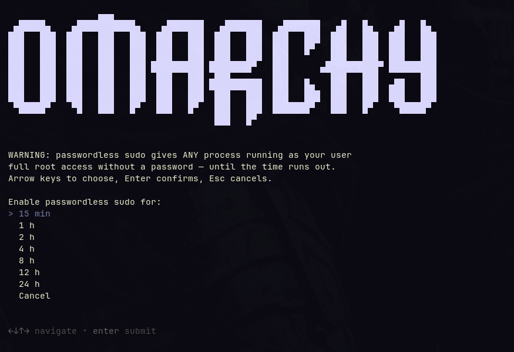

# Omarchy Better Passwordless Sudo

Replaces Omarchy's **Setup → Security → Passwordless Sudo** menu entry with a
duration picker. Instead of the hard-coded 15 minutes you get 15 min and 1, 2,
4, 8, 12 and 24 hours — arrow keys to choose, 15 min preselected.

The interface speaks the system language.



If passwordless sudo is already active, the header shows the remaining time and
the list gains a **Disable** entry; picking a duration re-arms the timer.


## Installation

### From the AUR

```bash
yay -S omarchy-better-passwordless-sudo
omarchy-better-passwordless-sudo --setup-menu
```

The package installs system-wide, but the menu entry belongs to a single user's
config, so a package cannot place it for you — `--setup-menu` does that, once,
for whoever runs it. Before removing the package, run
`omarchy-better-passwordless-sudo --remove-menu` while the command is still
there.

### From a checkout

```bash
git clone https://github.com/FloMaetschke/omarchy-better-passwordless-sudo.git
cd omarchy-better-passwordless-sudo
./install.sh
```

The installer puts the script in `~/.local/bin/`, the translations in
`~/.local/share/omarchy-better-passwordless-sudo/locale/`, and has the installed
copy add the menu entry to `~/.config/omarchy/extensions/omarchy-menu.jsonc`. It
is safe to run repeatedly: an existing entry is replaced, not duplicated. The
menu file is backed up before every change.

```bash
./uninstall.sh
```

removes all three again; Omarchy's stock entry with its fixed 15 minutes then
applies once more.

Requirements: an Omarchy installation with `gum`, `systemd` and `sudo` — all
present on any Omarchy system.

## Languages

68 languages. The language comes from `LC_ALL`, else `LC_MESSAGES`, else
`LANG`. The full form is looked up first (`zh_TW`), then the bare language code
(`zh`), then English.

| | | |
|---|---|---|
| `af` Afrikaans | `ar` العربية | `bg` Български |
| `bn` বাংলা | `bs` Bosanski | `ca` Català |
| `cs` Čeština | `da` Dansk | `de` Deutsch |
| `el` Ελληνικά | `en` English | `es` Español |
| `et` Eesti | `eu` Euskara | `fa` فارسی |
| `fi` Suomi | `fr` Français | `ga` Gaeilge |
| `gu` ગુજરાતી | `he` עברית | `hi` हिन्दी |
| `hr` Hrvatski | `hu` Magyar | `hy` Հայերեն |
| `id` Bahasa Indonesia | `is` Íslenska | `it` Italiano |
| `ja` 日本語 | `ka` ქართული | `kk` Қазақша |
| `km` ភាសាខ្មែរ | `kn` ಕನ್ನಡ | `ko` 한국어 |
| `lt` Lietuvių | `lv` Latviešu | `mk` Македонски |
| `ml` മലയാളം | `mn` Монгол | `mr` मराठी |
| `ms` Bahasa Melayu | `mt` Malti | `my` မြန်မာ |
| `nb` Norsk bokmål | `ne` नेपाली | `nl` Nederlands |
| `pa` ਪੰਜਾਬੀ | `pl` Polski | `pt` Português |
| `ro` Română | `ru` Русский | `si` සිංහල |
| `sk` Slovenčina | `sl` Slovenščina | `sq` Shqip |
| `sr` Српски | `sv` Svenska | `sw` Kiswahili |
| `ta` தமிழ் | `te` తెలుగు | `th` ไทย |
| `tl` Filipino | `tr` Türkçe | `uk` Українська |
| `ur` اردو | `uz` Oʻzbekcha | `vi` Tiếng Việt |
| `zh` 简体中文 | `zh_TW` 繁體中文 |  |

Translations live in their own files under `locale/<code>.sh` and are installed
to `~/.local/share/omarchy-better-passwordless-sudo/locale/`. The script looks
for them in this order: `$OMARCHY_BETTER_PASSWORDLESS_SUDO_LOCALE_DIR`, the
install directory, then `../locale` next to the script — so it also runs
straight from a checkout.

Adding a language means writing one file with the same fifteen `T_*` variables.
The duration labels are bound to the **index** of the minute values, not to
their text, so translated units cannot shift anything. `T_ACTIVE`, `T_CHOSEN`,
`T_UPDATED` and `T_NOW_ON` each carry exactly one `%s` for the time; it is
substituted as text rather than through `printf`, so a stray `%` in a
translation cannot break anything.

One caveat about the translations: English and German have been reviewed, all
the others are machine-generated and have not been checked by native speakers.
Corrections are welcome. For the right-to-left languages (`ar`, `fa`, `he`,
`ur`) the layout depends on how well your terminal handles bidirectional text —
selection works, but the rendering may be off. Scripts outside the Latin
alphabet need a terminal font that carries the glyphs.

## How it works

The same way Omarchy's original does: a file
`/etc/sudoers.d/99-omarchy-nopasswd-$USER` holding `NOPASSWD: ALL`, plus a
transient systemd timer `omarchy-nopasswd-expire-$USER.timer` that deletes it
when the time is up. To check what is left:

```bash
systemctl list-timers 'omarchy-nopasswd*' --all
```

Three details that are easy to get wrong when building something like this:

- The timer is armed with `--on-active` and is therefore **monotonic**, which
  leaves `NextElapseUSecRealtime` empty. The remaining time comes from
  `systemctl list-timers -o json`, field `next`.
- The menu entry checks the **timer** for its checkmark, not the sudoers file.
  That file sits in a directory only root may read, so testing it would trigger
  a password prompt every time the menu opens.
- As soon as stdout is captured by a command substitution — `choice=$(gum
  choose …)` — gum draws its interface on **stderr**. Redirecting stderr to
  suppress its "nothing selected" line makes the whole picker invisible while
  the keys still work.

## Why this is not an Omarchy plugin

An Omarchy shell plugin is Quickshell/QML: every `kind` (`bar`, `bar-widget`,
`menu`, `overlay`, `panel`, `service`) requires a QML entry point, and
`omarchy plugin validate` rejects anything else. A plugin cannot contribute menu
entries either — `Menu.qml` reads exactly two files, the default one and the
user's single extension file. A bash script plus a menu entry does not fit that
format, so it ships with an installer instead.

## Security

Passwordless sudo removes a real layer of protection: **any** process running
under your user account can become root without being asked, for as long as it
lasts. Pick the shortest duration that gets the job done.

The timer does not survive a reboot. If the sudoers file is left behind without
its timer, the script deletes it immediately on the next run — the same
precaution the original takes.

## License

MIT, see [LICENSE](LICENSE).
